# DESPLIEGUE — Evidencias y respuestas

Este documento recopila todas las evidencias y respuestas de la practica.

---

## Parte 1 — Evidencias minimas

### Fase 1: Instalacion y configuracion

1) Servicio Nginx activo
- Que demuestra: El funcionamiento de los contenedores y del servicio del propio contenedor de servidor-nginx.
- Comando: `docker compose ps` y `docker exec servidor-nginx service nginx status`
- Evidencia: 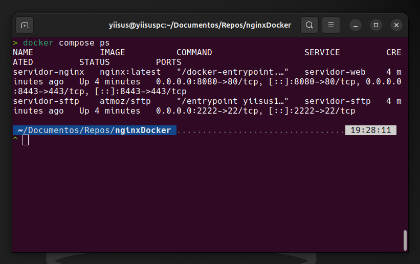 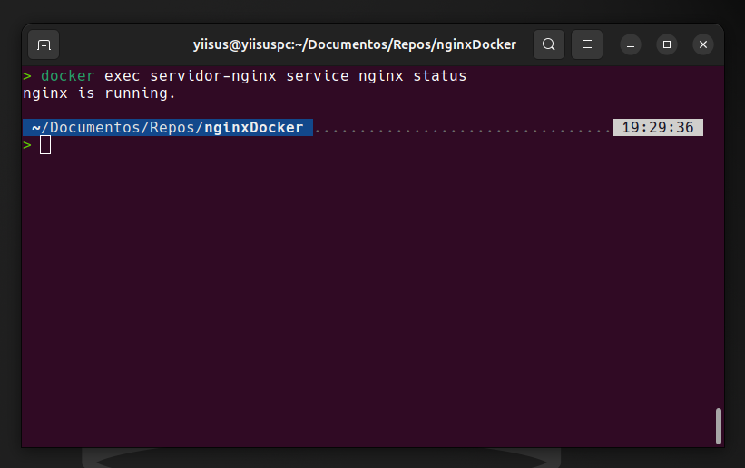

2) Configuracion cargada
- Que demuestra: Que la configuración ha sido cargada correctamente.
- Comando: `docker exec servidor-nginx ls -l /etc/nginx/conf.d/`
- Evidencia: 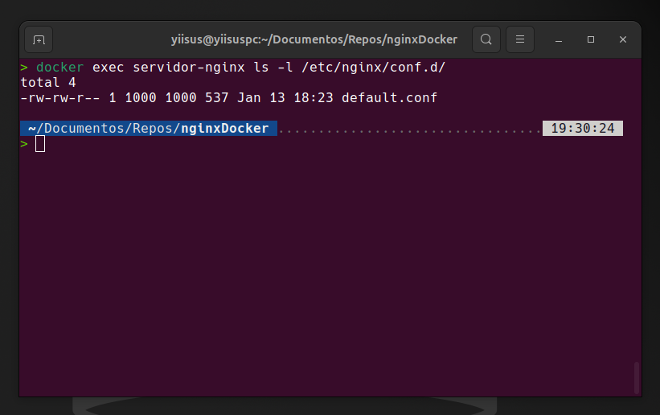

3) Resolucion de nombres
- Que demuestra: Que se le ha asignado un nombre/alias a la dirección en el archivo /etc/hosts.
- Evidencia: 

4) Contenido Web
- Que demuestra: Que la web requerida ha sido cargado correctamente.
- Evidencia: 

### Fase 2: Transferencia SFTP (Filezilla)

5) Conexion SFTP exitosa
- Que demuestra: La conexión exitosa mediante FileZilla.
- Evidencia: 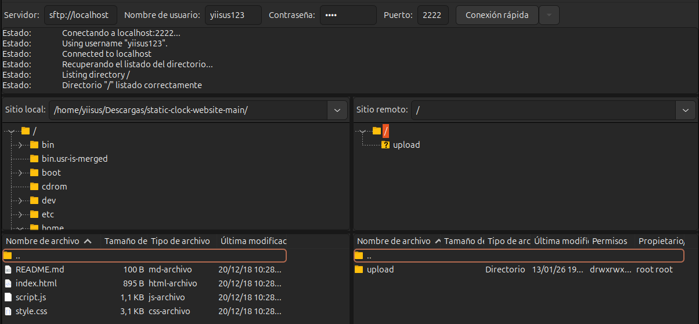

6) Permisos de escritura
- Que demuestra: Los permisos de escritura para poder subir archivos.
- Evidencia: 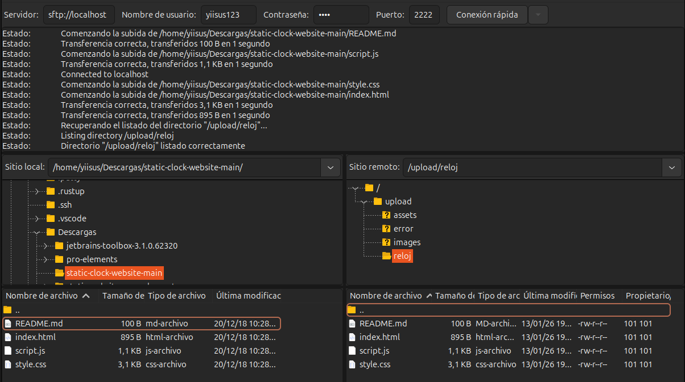

### Fase 3: Infraestructura Docker

7) Contenedores activos
- Que demuestra: La actividad de los contenedores.
- Comando: `docker compose ps`
- Evidencia: 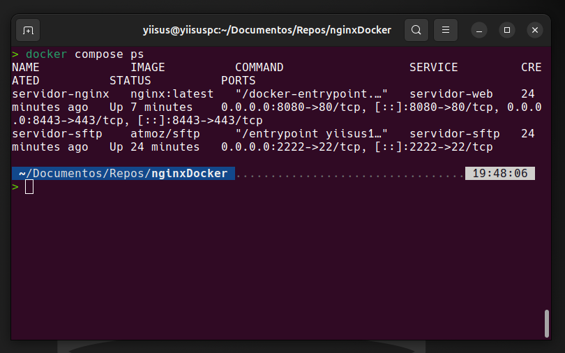

8) Persistencia (Volumen compartido)
- Que demuestra: La funcionalidad del volumen, mostrando la web activa mientras que se ve FileZilla y los archivos subidos anteriormente.
- Evidencia: 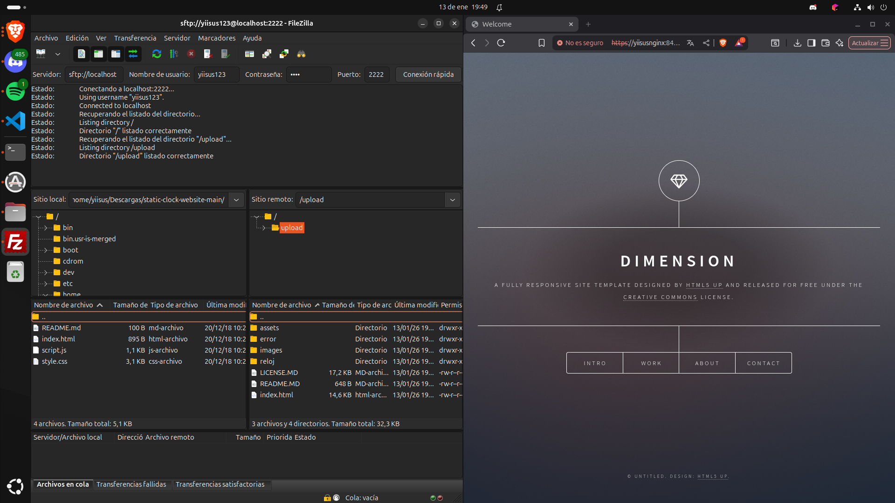

9) Despliegue multi-sitio
- Que demuestra: El funcionamiento de la página /reloj.
- Evidencia: 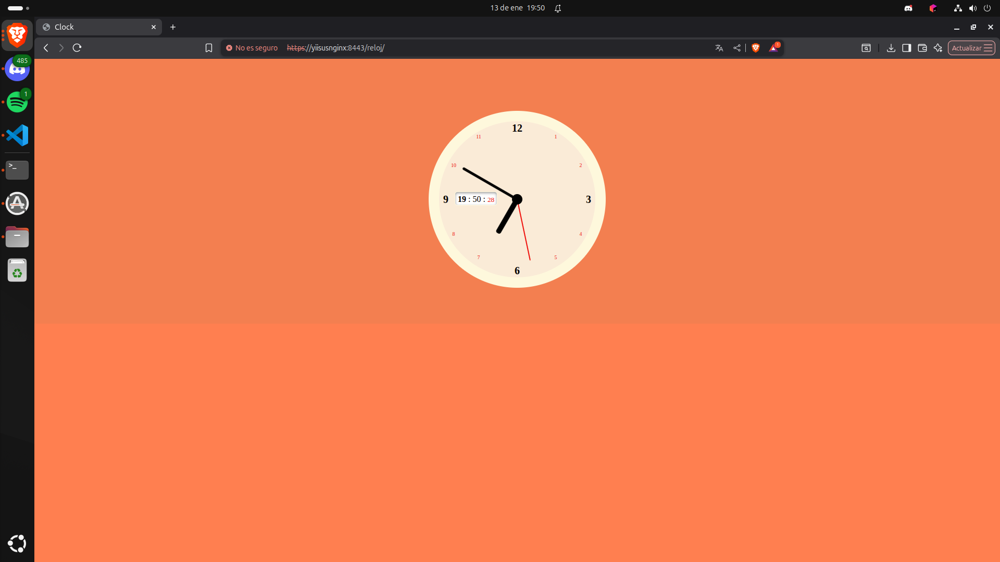

### Fase 4: Seguridad HTTPS

10) Cifrado SSL
- Que demuestra: Que la página es accesible mediante HTTPS.
- Evidencia: 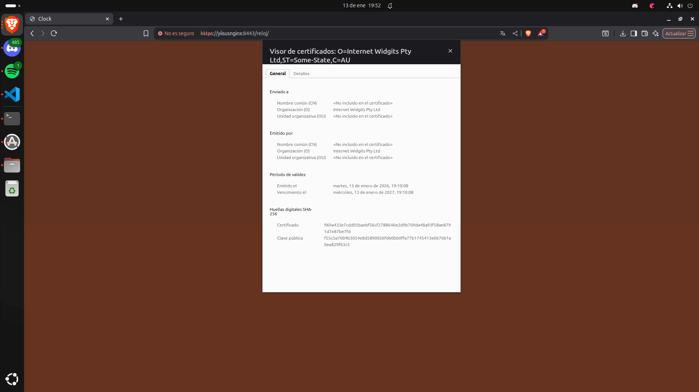 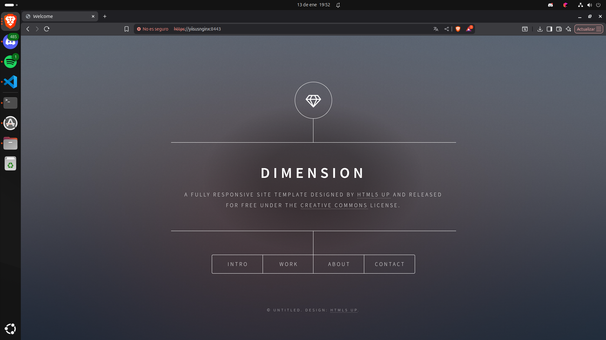

11) Redireccion forzada
- Que demuestra: Que tras intentar acceder mediante HTTP automaticamente redirige a la página de manera HTTPS
- Evidencia: 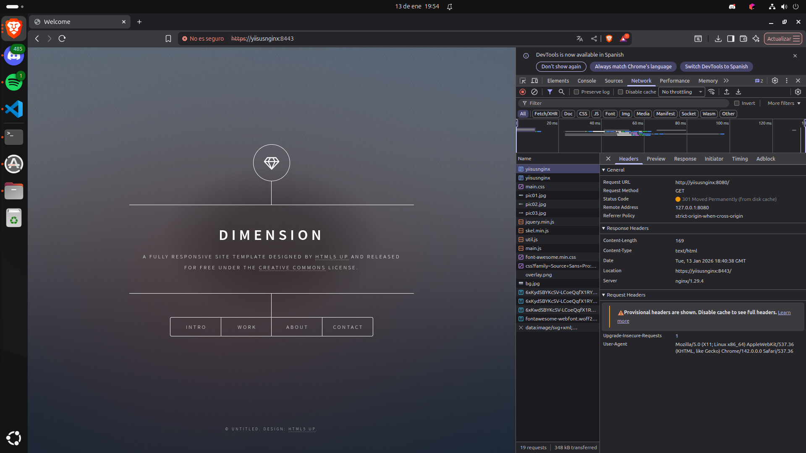

---

## Parte 2 — Evaluacion RA2 (a–j)

### a) Parametros de administracion
- Respuesta:
- Evidencias:
  - evidencias/a-01-grep-nginxconf.png
  - evidencias/a-02-nginx-t.png
  - evidencias/a-03-reload.png

### b) Ampliacion de funcionalidad + modulo investigado
- Opcion elegida: B1 (Gzip)
- Respuesta:
- Evidencias:
  - evidencias/b1-01-gzipconf.png
  - evidencias/b1-02-compose-volume-gzip.png
  - evidencias/b1-03-nginx-t.png
  - evidencias/b1-04-curl-gzip.png

#### Modulo investigado: ModSecurity WAF

**Para qué sirve:** Firewall de aplicaciones web (WAF) que protege contra ataques como SQL injection, XSS, y otras vulnerabilidades OWASP. Monitoriza y analiza tráfico HTTP en tiempo real.

**Cómo se instala/carga:** Principalmente por compilación desde código fuente (requiere dependencias como libcurl, libxml2, libyajl). Se integra como módulo dinámico con `load_module modules/ngx_http_modsecurity_module.so;` y se activa con `modsecurity on;` en la configuración del server.

**Fuentes:**
- https://blog.nginx.org/blog/compiling-and-installing-modsecurity-for-open-source-nginx
- https://github.com/owasp-modsecurity/ModSecurity
- https://www.linuxbabe.com/security/modsecurity-nginx-debian-ubuntu

### c) Sitios virtuales / multi-sitio
- Respuesta:
- Evidencias:
  - evidencias/c-01-root.png
  - evidencias/c-02-reloj.png
  - evidencias/c-03-defaultconf-inside.png

### d) Autenticacion y control de acceso
- Respuesta:
- Evidencias:
  - evidencias/d-01-admin-html.png
  - evidencias/d-02-defaultconf-auth.png
  - evidencias/d-03-curl-401.png
  - evidencias/d-04-curl-200.png

### e) Certificados digitales
- Respuesta:
- Evidencias:
  - evidencias/e-01-ls-certs.png
  - evidencias/e-02-compose-certs.png
  - evidencias/e-03-defaultconf-ssl.png

### f) Comunicaciones seguras
- Respuesta:
- Evidencias:
  - evidencias/f-01-https.png
  - evidencias/f-02-301-network.png

### g) Documentacion
- Respuesta:
- Evidencias: enlaces a todas las capturas

### h) Ajustes para implantacion de apps
- Respuesta:
- Evidencias:
  - evidencias/h-01-root.png
  - evidencias/h-02-reloj.png

### i) Virtualizacion en despliegue
- Respuesta:
- Evidencias:
  - evidencias/i-01-compose-ps.png

### j) Logs: monitorizacion y analisis
- Respuesta:
- Evidencias:
  - evidencias/j-01-logs-follow.png
  - evidencias/j-02-metricas.png

---

## Checklist final

### Parte 1
- [ ] 1) Servicio Nginx activo
- [ ] 2) Configuracion cargada
- [ ] 3) Resolucion de nombres
- [ ] 4) Contenido Web (Cloud Academy)
- [ ] 5) Conexion SFTP exitosa
- [ ] 6) Permisos de escritura
- [ ] 7) Contenedores activos
- [ ] 8) Persistencia (Volumen compartido)
- [ ] 9) Despliegue multi-sitio (/reloj)
- [ ] 10) Cifrado SSL
- [ ] 11) Redireccion forzada (301)

### Parte 2 (RA2)
- [ ] a) Parametros de administracion
- [ ] b) Ampliacion de funcionalidad + modulo investigado
- [ ] c) Sitios virtuales / multi-sitio
- [ ] d) Autenticacion y control de acceso
- [ ] e) Certificados digitales
- [ ] f) Comunicaciones seguras
- [ ] g) Documentacion
- [ ] h) Ajustes para implantacion de apps
- [ ] i) Virtualizacion en despliegue
- [ ] j) Logs: monitorizacion y analisis
